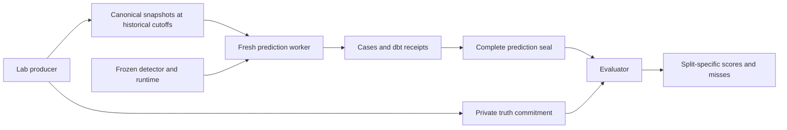

# NEMO Blind Lab — Milestone 6

## What this milestone implements
A reproducible evaluation workflow freezes the M5 detector, generates development,
calibration and held-out worlds, crops canonical observations at scheduled historical
cutoffs, seals predictions and dbt receipts, then joins separately committed truth.
It scores diagnosis, localization, false alerts, tracking routing and checkpoint lag.

Read [the learning guide](learning-blind-evaluation.md) for eight-part explanations,
worked examples, formulas and interview preparation.

## Roles and data flow


blind_lab.py runs on the producer/evaluator side and is permitted to read truth.
blind_worker.py runs the existing canonical warehouse and Decision Case pipeline in
a fresh subprocess. It receives a generic temporary observations folder and comparison
dates. No seed, incident label, target device, onset parameter or private path is passed
to that worker. The detector and its thresholds remain unchanged from M5.

The worker blocks lab/evaluator imports and Python reads of private paths or files
outside its workspace, package and Python runtimes. Temp files stay in its workspace.
These are accidental-access guards for trusted code, not a hostile-code OS sandbox.
The dbt child process and native extensions are trusted dependencies; the Python audit
hook does not enforce isolation inside native code or arbitrary child processes.

## Frozen benchmark recipe
Three separate generated worlds:
- Development: seed 101, Android payment intervention.
- Calibration: seed 202, desktop payment intervention.
- Held out: seed 303, Android payment intervention.

Every world spans May 1 through June 11, 2026. The intervention begins May 29.
Each has healthy, tracking-loss and payment-deterioration controls.
Each control is examined at exclusive cutoffs May 29, June 5 and June 12.
This produces 27 planned predictions, nine per split, across three independent worlds.

The healthy control contains the generator's natural random traffic/conversion variation.
No extra artificial noise mechanism is added. Each world has one private seed and all
its related controls/checkpoints stay in the same split. Calibration is reserved as a
separate diagnostic split; no policy fitting or threshold adjustment occurs in M6.
Held out means unseen by the frozen detector-development process, not secret source code.

Related controls and overlapping windows are correlated. Pre-incident copies within
one world can be identical. The 27 predictions are not 27 independent experiments.
Scores explicitly report world counts and raw denominators; no uncertainty interval or
production reliability estimate is claimed from this small suite.

The existing lab replaces a hash-selected subset of successful terminal payment events
with failures and removes the corresponding orders and purchases. Tracking-loss controls
remove purchase events but preserve commercial outcomes. These are controlled snapshot
perturbations, not a resimulation of downstream customer behavior or a fitted causal world.

## Historical cutoffs
Cropping happens before validation/warehouse building, not after the detector runs:
customers, sessions, paid orders and events are restricted by timestamps; advertising
rows by business date. Only retained order/session identities can appear in event links.
Timestamps are interpreted in the existing Asia/Kolkata business timezone.
The public observation end and declared completeness cutoff are updated and every
canonical file is checksummed again. No private file is copied.

Comparison windows are adjacent equal 14-day windows ending at each cutoff.
The first checkpoint precedes exposure, the next contains seven days of exposure,
and the last contains fourteen. Early exposure can be diluted by the fixed rolling window.
A missing order near a cutoff can remain pending under the M4 grace-period contract.

This is event-time history. It does not reproduce original ingestion arrival times
or correction histories. Never present it as a historical production backtest with
arrival-as-of guarantees.

## Commitment and sealing
prepare writes a public protocol with trial IDs, splits, comparison dates, source
manifest fingerprints, frozen detector/runtime fingerprints and a truth-file hash.
Labels, scenario identity, onset and seeds remain under private.

predict checks the frozen method before any work, validates canonical input checksums,
copies only declared public files, and launches the worker. A case revision must match
its frozen source, scope and analytical code hashes. The full dbt run_results receipt
is retained alongside each case. All 11 models and 25 tests must succeed.

A split seal lists every planned trial exactly once with case and dbt receipt hashes,
bound to the protocol hash. Existing sealed results are verified on replay.
A partial run can resume completed predictions. A conflicting partial receipt is
rejected; create a new run or explicitly recover after inspecting the interrupted work.
No failing prediction is silently removed from the benchmark.

score verifies the complete seal, source/method binding and dbt receipts before reading
truth. It verifies the precommitted truth hash and trial coverage, then scores the split.
A changed case, receipt, protocol, truth file or incomplete seal is rejected.
Hashes detect accidental changes; a malicious owner able to rewrite all artifacts is
outside this local integrity model. External notarization and tamper-resistant storage
are not implemented.

## Exact scoring definitions
| Output | Numerator | Denominator |
|---|---|---|
| Exact diagnosis | Finding exactly equals expected class | All planned split predictions |
| Payment detection recall | payment_stage_hypothesis on a planted payment case | Active payment cases |
| Exact device localization | Correct payment finding and exactly the planted device | Active payment cases, including misses |
| Healthy false-positive rate | Business/conversion/measurement alert on an expected no_signal case | Expected no_signal cases |
| Tracking routing recall | measurement_issue on a tracking-loss case | Active tracking cases |

The class confusion table retains every returned finding, including insufficient-data
or insufficient-measurement outcomes. Such abstentions remain in accuracy denominators;
they are not detections. They are not counted as healthy alerts. Empty metric denominators
return null. Fraction values retain their numerator and denominator.

Tracking cases with eligible investigations are counted separately as a gate failure
indicator. This is not a test that authorizes an economic or production action.

For each incident trajectory, first_correct_cutoff is the first post-onset checkpoint
with the correct diagnosis and, for payment problems, correct device localization.
lag_days = checkpoint − onset. If there is no correct checkpoint, lag_days is null,
right_censored is true and horizon_days reports the evaluated observation horizon.
The schedule cannot establish a more precise continuous detection time.

The scorer does not grade magnitude estimates because M5 does not estimate incremental
impact. It never treats an arithmetic period difference as the hidden intervention effect.

## Commands
Use a new output root for each frozen benchmark:
```powershell
.venv/Scripts/python.exe -m nemo.blind_lab prepare --root artifacts/blind-new
.venv/Scripts/python.exe -m nemo.blind_lab predict --root artifacts/blind-new --split development
.venv/Scripts/python.exe -m nemo.blind_lab predict --root artifacts/blind-new --split calibration
.venv/Scripts/python.exe -m nemo.blind_lab predict --root artifacts/blind-new --split held_out
.venv/Scripts/python.exe -m nemo.blind_lab score --root artifacts/blind-new --split development --output artifacts/blind-new/development-scores.json
.venv/Scripts/python.exe -m nemo.blind_lab score --root artifacts/blind-new --split calibration --output artifacts/blind-new/calibration-scores.json
.venv/Scripts/python.exe -m nemo.blind_lab score --root artifacts/blind-new --split held_out --output artifacts/blind-new/held_out-scores.json
```

The verified run is artifacts/milestone-6. All three prediction splits were sealed
before any labels were scored. Read split score files, then case evidence and private
labels when investigating misses. Do not change the detector and reuse the old freeze.

## Verification and limitations
The targeted suite has 15 tests covering score denominators, missed/localized conditions,
scheduled lag and censoring, future-row exclusion, manual canonical worker execution,
sealed replay, case/truth/protocol/receipt tampering, missing seals, method drift,
private reads, blocked lab imports and prediction invariance to changed truth.
All 148 repository tests pass. Installed-package prediction/scoring and all 27 sealed
dbt receipts verify successfully. See milestone-6.md for split results and the two misses.

M1–M5 contracts are preserved. No new metric, causal estimator, optimizer, production
connector or Snowflake integration is added. The small benchmark deliberately reports
misses rather than tuning thresholds to manufacture a perfect score.

## Next
Stop before Milestone 7 — Customer Economics until the user says proceed.
