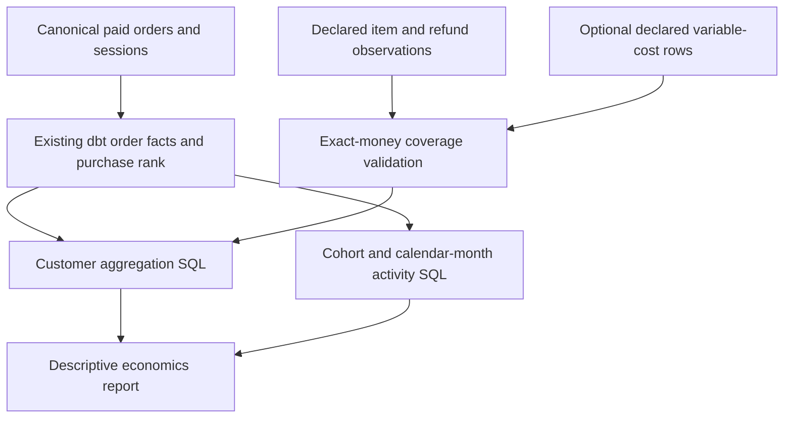

# Customer Economics — Milestone 7 contracts and walkthrough

## Implemented scope
Customer acquisition, monthly buyer cohorts, calendar-month purchase retention,
historical customer value and scoped order contribution. These are observed-history
measures. No customer lifetime forecast, causal acquisition claim, optimization or
profit estimate is implemented.

Read [the learning guide](learning-customer-economics.md) for the eight-part explanations,
worked examples, formulas, failure modes and interview questions.

## Architecture


economics_inputs.py validates and normalizes the supplemental canonical inputs.
economics.sql aggregates refunds before joining to paid orders, then produces one row
per observed buyer. retention.sql computes distinct buyer activity against an explicit
cohort/age grid. economics.py assembles the report and exact numerator/denominator ratios.

The existing dbt facts and purchase_rank determine first-observed acquisition. There is
no second ranking algorithm and no generator import. The dbt graph is unchanged.
Supplemental inputs are checksummed and normalized into temporary files; SQL reads those
exact bytes. This extends the M4/M5 canonical supplemental-input boundary rather than
introducing an unrelated analytics engine or production connector.

The warehouse and supplied manifest fingerprint must match. Company adapters can provide
the same item/refund/cost contracts. Original M1 files and its private state are not needed
by the economics engine. The original M1 has no cost feed and no M7 coverage assertion;
the lab prepares new copies that explicitly declare their supported coverage.

## Public economics contract
An optional manifest economics_contract is version 1:

```json
{
  "version": "1",
  "refunds": {
    "basis": "tax_exclusive_merchandise",
    "coverage_end_exclusive": "2025-04-15"
  },
  "variable_costs": {
    "basis": "order_costs_net_of_recoveries",
    "coverage_end_exclusive": "2025-04-15",
    "components": [
      "net_cogs_paise",
      "fulfillment_paise",
      "payment_fees_paise",
      "refund_handling_paise",
      "other_variable_costs_paise"
    ],
    "provenance": "observed"
  }
}
```

The cutoff must equal the warehouse's exclusive snapshot end. Both sections are optional.
Missing coverage remains unknown. A declared feed with a missing file, malformed row or
bad checksum is an error, not an empty feed.

Coverage and observed provenance are source assertions, not independently audited proof
of completeness or financial truth. Reports retain those assertions and source hashes.

### Refund requirements
The order_items and refunds table entries contain exact row counts and SHA-256 hashes.
Items have unique IDs, existing order IDs, positive integer quantity/unit price and
amount_paise = quantity × unit_price_paise. Every paid order must reconcile to its items.

Refunds have unique IDs, an existing order_item_id, positive quantity and the same
unit-value basis. Cumulative refunded quantity cannot exceed the item quantity.
Refund timestamps must be UTC, no earlier than payment, and inside the snapshot window.
This v1 contract supports the existing whole-unit merchandise refund representation.
Arbitrary goodwill credits or price-only adjustments require a future explicit contract.

Refunds are observed through cutoff and assigned back to their paid order/customer.
They reduce historical value but do not erase a historical purchase or acquisition.
Absent coverage produces null net receipts, not an assumed zero refund.
Items are checked for money and order linkage; no new product-catalog validator is claimed.

### Cost requirements
order_variable_costs is one row per supplied order_id. Duplicate/unknown order IDs fail.
All five named components must be explicit. Each is either a nonnegative signed-64-bit
integer in paise or null. Null means unknown. Omitting a component is a schema error.

Costs are net of recoveries through the same cutoff. Do not subtract returned inventory
recoveries twice. Negative net cost components/rebates outside this representation need
a future explicit contract. A resulting negative contribution is supported.

If any component or order cost row is unknown, the affected customer/cohort contribution
is null. Aggregate reports never drop uncovered buyers to make the remaining mean look
complete. cost_covered_orders exposes the denominator alongside costs_declared.

The scope includes declared order-variable costs only. It excludes acquisition spending
and fixed overhead. Therefore contribution_paise means scoped order contribution before
those exclusions, not total company contribution, accounting profit or incremental profit.
Full CAC remains unavailable without its separate acquisition-cost contract.

## Acquisition, cohorts and value
Only customers with paid orders enter buyer cohorts. Other canonical customer rows are
visitors, not a buyer denominator. purchase_rank = 1 supplies the earliest observed
paid date, channel, campaign, device and paid flag; later purchases do not change that
credit. Corrected earlier history may legitimately revise it on a rebuilt warehouse.

Cohort month uses Asia/Kolkata calendar time. All customer and cohort financial values
sum the supplied order history through the snapshot cutoff. Repeat buyers have at least
two paid orders anywhere in that history. Repeat-buyer rate has unequal follow-up and
must not be mistaken for a fixed-horizon retention probability.

Historical net value per buyer divides net merchandise receipts by all buyers in the
group. The exact integer numerator and denominator remain in the report; displayed
ratios use six decimal places with half-up rounding. Totals use wide integer arithmetic,
including cost sums beyond one signed-64-bit value. Monetary totals never use float.

## Retention grid
Each cohort has ages 0 through max_age_months, default 12 and configurable 0–120.
Age is a calendar-month difference, not elapsed 30-day periods.
A buyer with several orders in a target month counts once.

| Cell state | Observed activity | Retention rate |
|---|---|---|
| Completed month | Count, including zero | active buyers / original cohort buyers |
| Partial month | Activity observed so far | null |
| Future month | null | null |

Month 0 records acquisition-month purchase activity, not necessarily repeat activity.
A return after skipping a month counts in that later month. Refund dates do not create
retention activity. Cohort/age combinations beyond the selected max age are not emitted.

## Worked manual fixture
The automated fixture has four customer IDs; one is a visitor with no purchase.
Buyer c1 pays ₹1,000 in January and ₹500 in February, then receives a ₹200 refund in
March. Buyer c2 pays ₹1,000 in January. Buyer c3 pays ₹400 in March.
The snapshot ends April 15.

- Buyers: 3; paid orders: 4; repeat buyers: 1.
- Gross merchandise: ₹2,900; refunds: ₹200; net merchandise: ₹2,700.
- Historical net value per buyer: ₹900.
- Explicit order-variable costs: ₹1,639; scoped contribution: ₹1,061.
- January cohort size: 2; February activity: 1; month-1 retention: 1/2.
- March activity for that cohort: 0, even though March contains a refund.
- April is partial, so retention is unknown rather than zero.
- c1 retains Direct acquisition credit despite a later Paid Social purchase.

## Full reference demonstration
artifacts/milestone-7 contains refunds_only and assumed_costs snapshots, warehouses
and economics.json reports. Both retain all original paid-order observations.

| Measure | Value |
|---|---:|
| First-observed buyers | 5,574 |
| Paid orders | 5,989 |
| Repeat buyers | 381 |
| Gross merchandise receipts | 1,380,800,300 paise |
| Merchandise refunds | 83,655,300 paise |
| Net merchandise receipts | 1,297,145,000 paise |
| Refund-only contribution | null: no costs supplied |

The assumed-cost control declares synthetic_assumption. Its toy producer assumes net
COGS equal to 50% of retained merchandise, ₹100 fulfillment per order, fees equal to
2% of gross receipts, ₹20 handling per refunded order and explicit zero other costs,
rounding down to integer paise. These are demonstration assumptions, not estimates
of company costs. Analytics consumes cost observations, never the private assumption file.

Those inputs yield variable costs of 737,870,506 paise and scoped contribution of
559,274,494 paise. Neither figure is reported as real-world profit or a budget opportunity.
The paired control proves contribution stays unavailable until costs are explicitly supplied.

## Reproduce and explore
Use a new lab output root:
```powershell
.venv/Scripts/python.exe -m nemo.lab_economics --observations artifacts/milestone-1-verified/observations --output artifacts/economics-new
.venv/Scripts/python.exe -m nemo.warehouse build --observations artifacts/economics-new/refunds_only/observations --database artifacts/economics-new/refunds_only/nemo.duckdb
.venv/Scripts/python.exe -m nemo.economics --warehouse artifacts/economics-new/refunds_only/nemo.duckdb --observations artifacts/economics-new/refunds_only/observations --max-age 18 --output artifacts/economics-new/refunds_only/report.json
```

Repeat the build/report commands with assumed_costs for the second control.
To inspect the already verified report:
```powershell
.venv/Scripts/python.exe -m nemo.economics --warehouse artifacts/milestone-7/assumed_costs/nemo.duckdb --observations artifacts/milestone-7/assumed_costs/observations --max-age 18
.venv/Scripts/python.exe -m pytest tests/test_economics.py --tb=short
```

Lab and report commands refuse to overwrite existing output artifacts. Read the contracts,
then trace economics_inputs.py → economics.sql/retention.sql → economics.py. Compare
customers, acquisition and cohorts with total; completed dimensions must reconcile.

## Limits
No forecast LTV, subscription churn, discounted value, full CAC, profit model, incremental
economics or recommendation engine. Recent cohorts have less follow-up. Identity and
coverage are supplied-source assumptions. Refund/cost corrections can restate historical
value; original arrival history is not reconstructed. Production extraction, Snowflake
execution and a persistent refund/cost dbt mart remain future integration work.
