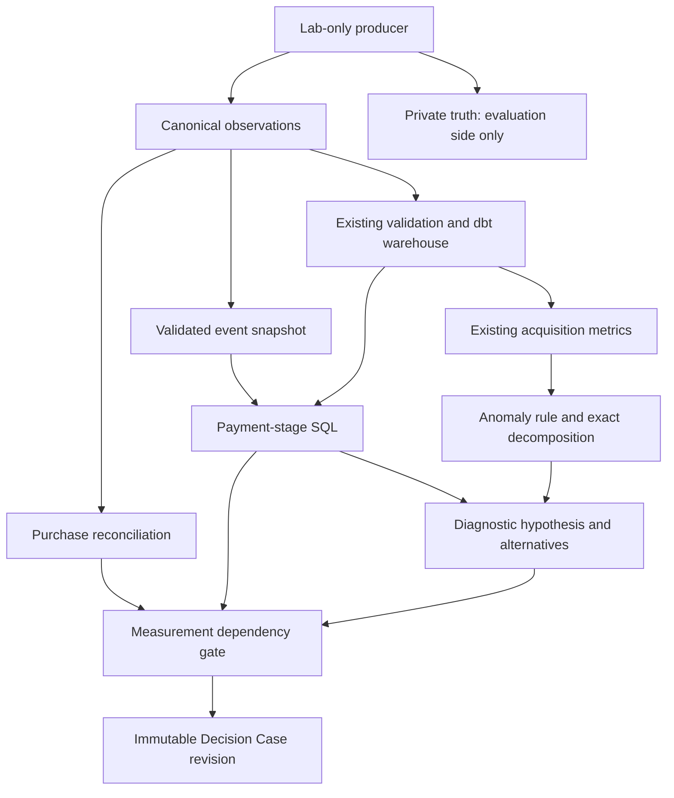

# Milestone 5 — First Decision Case

## Outcome
Implemented a bounded observation-only diagnostic slice: an operational anomaly rule,
exact KPI decomposition, device-level payment-stage evidence and immutable Decision Cases.
The detector distinguishes the healthy reference, missing purchase tracking and the
planted business deterioration. It does not read private truth or generator configuration.

Learning materials:
- [Concepts, formulas, failure modes and interview explanations](learning-decision-cases.md)
- [Hands-on lab, code tracing and calculation exercises](learning-lab-walkthrough.md)

## Why a business needs this
A conversion decline can arise from traffic changes, payment problems or broken
measurement. The case records observations and uncertainty before proposing an
investigation. It preserves merchandise receipts as receipts, with no profit or
incremental-impact claim.

## Scope and acceptance
- Use equal adjacent comparison windows ending at the canonical snapshot cutoff.
- Retain the existing purchasing-session CVR definition and exact-money observations.
- Apply predeclared, versioned operational thresholds, with insufficient-data outcomes.
- Decompose purchasing-session change into exact traffic-volume and conversion-rate components.
- Check canonical payment-stage consistency before interpreting device differences.
- Distinguish tracking loss from observed payment deterioration.
- Preserve source hashes, method hashes, evidence, alternatives and gated next steps.
- Replay identical cases without duplicate revisions; never overwrite an existing revision.
- Prove all of this with manually authored observations, lab controls and blocked imports.

## Architecture


decision_case.py consumes the existing warehouse and public observations. funnel.sql
aggregates one row per session before device/period comparison. It does not join raw
event rows directly into acquisition sums. The temporary event input contains the exact
checksummed bytes assessed by the source boundary. No persistent event mart is introduced.

The public funnel_contract is version 1 with semantics
one_payment_attempt_and_terminal_event_per_attempting_session. Retries or multiple paid
orders in one session do not satisfy it. Such sources need a future explicit contract,
not silent coercion. Production adapters can provide this supported canonical subset
without executing M1 or a lab module.

## Analytical contracts
Overall rule: at least 100 sessions in both windows; positive baseline CVR; decline
of at least 2 percentage points and 25% relative. This is not statistical significance.
Device payment evidence: at least 30 attempting sessions in both periods and at least
a 20 percentage-point payment-success decline. Insufficient samples are labelled unknown,
not treated as contradictory evidence.

Purchasing-session change is decomposed using the midpoint identity explained in the
concept guide. Components retain exact rational numerators and denominators.
Device count contributions add to the total count change. Neither allocation is causal.

Structural payment checks require one attempt and one terminal event per attempting
session; success must correspond to a paid order and its session, terminal time must
follow attempt time, and attempts cannot precede session start. Event IDs, purchase
correspondence, source checksums and other identity issues are checked by M4.
Shared omissions can still evade consistency checks.

The payment_funnel_investigation candidate requires both purchase_tracking and
payment_funnel confidence. It recommends manual inspection of payment errors, provider
responses and release history. It does not assert a release caused the decline.
Attribution and budget optimization remain blocked on their own unassessed dependencies.

## Case contract and storage
A case contains:
- Logical case ID derived from dataset, mode, question and comparison scope.
- Revision ID derived from the complete deterministic payload, including source/method hashes.
- Analysis cutoff, status, owner (unknown), observations and metric definitions/versions.
- Measurement checks, exact decomposition, device comparisons and supporting evidence.
- Competing explanations, non-supporting adequately sampled devices, and next investigation.
- Measurement-gated recommendations, unsupported economic actions and null incremental profit.
- Provenance and explicit limitations.

Files are named case_id-revision_id.json. Identical replay is a no-op; differing content
at an existing path is rejected. A changed source or method creates a new revision.
This local immutable artifact store is not yet the Decision Ledger, an atomic distributed
store, or a production authorization system. A process interrupted mid-write can leave
a partial file that is rejected on replay and requires explicit recovery.

## Controlled demonstration
Two adjacent 14-day windows: June 3–16 and June 17–30, 2026.

| Control | Baseline purchasing sessions / sessions | Current | Finding |
|---|---:|---:|---|
| Healthy | 151 / 1,242 | 123 / 1,129 | no_signal |
| Tracking loss | 151 / 1,242 | 123 / 1,129 | measurement_issue |
| Payment deterioration | 151 / 1,242 | 65 / 1,129 | payment_stage_hypothesis: android |

The business lab replaces a fixed hash-selected subset of Android successful payments
with failures and removes their orders/purchase events together: 58 orders in this run.
Purchase reconciliation still passes because the commercial and event observations agree.
The detector sees an 86-purchasing-session decline against baseline, not the hidden
58-order intervention amount. It does not claim to identify the causal effect.

The tracking control removes purchase events while retaining all paid orders and payment
outcomes. It therefore produces a measurement issue rather than a business-stage conclusion.

Original M1 files and artifacts are preserved. lab_payment imports the lab tracking
producer, but no analytical component imports either. Injection details live under private.
This is controlled observation perturbation; later customer behavior is not resimulated.

Latest case paths are recorded in artifacts/milestone-5/index.json. Each branch contains
its own canonical snapshot, warehouse, dbt artifacts and immutable case revisions.

## Verification
The full suite contains 133 tests: 116 existing tests and 17 Decision Case tests.
All 133 tests pass. The 17 Decision Case tests also pass after the final metric-contract
provenance addition. Ruff lint/format, wheel and source builds, and installed-wheel
verification pass. The installed package reproduces the identical case revision outside
the checkout. All three control warehouses passed 11 dbt models and 25 data tests;
freshness, compilation and docs generation also pass. M1 artifact checksums and original
generator module fingerprints are unchanged.
Tests include manual company-labelled canonical observations, healthy/tracking/business
separation, zero/small denominators, exact arithmetic, telemetry defects, source binding,
window validation, replay/revision behavior, deterministic lab controls and private truth
independence. No prior test or M1 generator guarantee is weakened.

Use the configured checks:
```powershell
.venv/Scripts/python.exe -m pytest --tb=short
.venv/Scripts/ruff.exe check .
.venv/Scripts/ruff.exe format --check .
uv build --offline --python .tools/python/cpython-3.12.13-windows-x86_64-none/python.exe --cache-dir .tools/uv-cache
```

The existing dbt builds execute 11 models and 25 data tests for each control.
The new funnel SQL also executes in the integration tests and installed-package smoke test.
No type checker is configured; no type-check result is claimed.

## Trade-offs and limits
The rule is deliberately interpretable and uncalibrated. Held-out evaluation, seasonality,
multiple testing, statistical power and detection-delay measurement belong to later work.
Two windows and device localization do not establish root cause. A device's traffic mix
may change alongside its payment outcomes.

Snapshot end is the analysis cutoff; there is no later-data parameter to accidentally
include future observations. Latest corrected data still does not represent what was
known on the historical date. The existing session CVR window censoring remains explicit.
Whole-snapshot integrity can conservatively block a narrower comparison.

This milestone does not build Snowflake integration, attribution, optimization, causal
inference, a web UI, AI recommendations or a complete Decision Ledger.

## Next milestone
Stop before Milestone 6 — Blind Evaluation Harness until the user says proceed.
