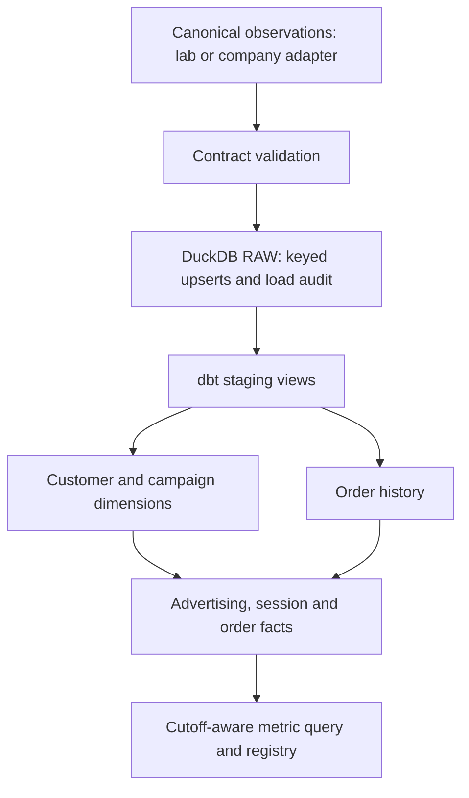

# Warehouse foundation

## Scope and learning
NEMO's data producers are replaceable. M1 is the reference/lab producer; a future adapter
must map company data into the same canonical model. The current loader accepts complete
cumulative snapshots, not arbitrary provider deltas. Extending ingestion must not rewrite
metric semantics. See [source architecture](source-architecture.md).

A grain is what one row represents. One ad row represents date × campaign × device;
one order row represents one paid order. Joining one ad row to three order rows would
repeat its spend three times. Aggregate compatible facts separately, then combine their
contributions. Dimensions describe entities; facts record observations at explicit grains.

Incremental loading means processing new/changed keys rather than blindly appending a
second copy. A ₹1,000 ad-spend record corrected to ₹900 must replace its previous amount.
NEMO uses normalized record hashes and an increasing arrival-batch ID. Business date is
not an incremental watermark: a correction can arrive today for last month.

RBAC assigns permissions to roles. The intended Snowflake loader writes RAW, the dbt role
reads RAW and builds analytical schemas, and the analyst reads only ANALYTICS. Role names
alone do not prove enforcement; credentialed positive/negative permission tests are required.

No new marketing or economic metric is introduced. Exact paise, first-observed acquisition,
purchase-session credit, missing full CAC, and non-causal ROAS retain their M2 contracts.

## Actual local path



The existing SQLite-backed reader validates canonical input types, keys and references.
SQLite no longer executes acquisition analytics. Python ingestion normalizes source values;
dbt owns warehouse transformations; the registry owns ratio definitions. There is no
parallel old analytical pipeline. The M2 observations API uses a temporary real dbt
warehouse for compatibility. For repeated reporting, build once and use --warehouse.

One DuckDB file stores one dataset/mode. Canonical v2 supplies a dataset_id; schema 1
remains a legacy synthetic adapter. Use separate databases for separate schema-1 lab
worlds: the loader cannot infer a seed/world identity and deliberately never reads private truth.

## Models and grains

| Model | Grain / key | Source / relationships | Update and quality rules |
|---|---|---|---|
| stg_customers | customer_id | raw customers | View; typed canonical projection |
| stg_campaigns | campaign_id | raw campaigns | View; canonical channel and paid classification |
| stg_ad_performance | date × campaign × device | raw advertising | View; date normalized |
| stg_sessions | session_id | raw sessions → customer/campaign | View; canonical UTC and business date |
| stg_orders | order_id | raw paid orders → session/customer | View; positive integer paise |
| int_order_history | order_id | stg_orders | Full-history rank by paid time then order ID |
| dim_customer | customer_id | stg_customers | Rebuilt table; unique/not null; visitor may not be a buyer |
| dim_campaign | campaign_id | stg_campaigns | Rebuilt table; unique/not null; explicit paid flag |
| fct_ad_performance | date × campaign × device | advertising + campaign | Incremental delete+insert; batch watermark; unique composite key |
| fct_sessions | session_id | sessions + earliest order date | Rebuilt table; unique/relationships; first payment cannot precede session |
| fct_orders | order_id | order history + session | Rebuilt table; unique/relationships; amounts and counts reconcile |

Natural keys are producer-namespaced canonical IDs. No decorative surrogate keys or
unused dimensions are introduced. Campaign names preserve brand/nonbrand labels from M1;
a future structured campaign classification needs an explicit contract, not name guessing.
Events, items and refunds remain available observation concepts for later funnel and
refund metrics; they are not silently translated into profit.

## Incremental and failure semantics
- Validate the whole input before opening the target; load all five tables in one transaction.
- Identical manifest replay is a no-op and does not renew row load timestamps.
- For changed snapshots, only changed/new records get a new batch ID and load timestamp.
- A new snapshot cannot change the dataset/mode, shift the history start, shrink the end,
  or remove existing keys. Deletions/CDC need an explicit contract; they are refused today.
- fct_ad_performance uses arrival batches, including campaign changes, for corrections.
- Session/order facts rebuild because a late earlier purchase can change prior history.
- A writer lock prevents cooperating builders from racing. A crash can leave a lock;
  verify that no writer is active before removing only that lock.
- A build marks the warehouse unready before dbt runs. Failed builds cannot be served by
  nemo-measure. A successful build records the batch and model fingerprint.
- Model changes require a rebuild. --full-refresh rebuilds dbt facts, not raw history.
- Readers open DuckDB read-only. This is local workflow protection, not tenant authorization.
- Reports are descriptive and still have measurement_health=not_assessed.

The warehouse holds the latest snapshot. Historical event windows are restated using
current observations, not reconstructed as-of-arrival history. Prior immutable inputs
are needed to rebuild an earlier state; load audit rows are not record-version history.

## Freshness and lineage
dbt source freshness checks the last loaded/changed row timestamp. The initial batch
contract warns after 24 hours and errors after 48 hours. This is an operational default,
not an empirically calibrated measurement-confidence score. A recent load does not prove
recent business events, complete tracking, or source correctness. Empty sources may have
unknown freshness. M4 will handle dependency-specific trust and reconciliation.

manifest.json, run_results.json, sources.json, catalog.json and docs HTML are written
under the database's sibling <name>-dbt directory. Telemetry is disabled for wrapper runs.
dbt build executes model and relationship/custom tests; source freshness is a separate
explicit command. Documentation and compile commands operate on the local warehouse.

## Commands

```powershell
uv sync --locked
uv run nemo-warehouse build --observations artifacts/demo/observations --database artifacts/warehouse/nemo.duckdb
uv run nemo-measure --warehouse artifacts/warehouse/nemo.duckdb --output artifacts/warehouse-report.json
uv run nemo-warehouse freshness --database artifacts/warehouse/nemo.duckdb
uv run nemo-warehouse compile --database artifacts/warehouse/nemo.duckdb
uv run nemo-warehouse docs --database artifacts/warehouse/nemo.duckdb
```

Use the project-local .venv/Scripts executables when Python/uv environment selection
requires the README's Windows setup. No remote credentials are needed for local runs.

## Snowflake status: configuration only, not verified
No Snowflake environment variables or local dbt profile were found. No remote account,
warehouse, raw loader, grants, query or dbt run was verified. Optional dbt-snowflake is
locked but not needed for local execution.

deployment/snowflake/bootstrap.sql is an administrator-reviewed template, not an
automatically executed migration. profiles.yml.example uses environment variables and
a private-key file path, with no credentials. Do not use administrative roles in NEMO.
The local Python loader writes DuckDB only; a Snowflake canonical-raw loader remains
credentialed integration work. The Python report executor is currently local-only;
a Snowflake query adapter must bind the same semantic query contract appropriately.

Before claiming connected mode: install the optional adapter, configure a reviewed
account/warehouse and canonical raw ingestion, build/test the dbt graph on Snowflake,
verify analyst SELECT and denied RAW/DML access, and compare results with canonical
fixtures. SQL syntax checks alone are not permission or integration verification.

References:
- [dbt incremental models](https://docs.getdbt.com/docs/build/incremental-models)
- [dbt freshness](https://docs.getdbt.com/reference/resource-properties/freshness)
- [DuckDB dbt adapter](https://github.com/duckdb/dbt-duckdb)
- [Snowflake access control](https://docs.snowflake.com/en/user-guide/security-access-control-overview)
